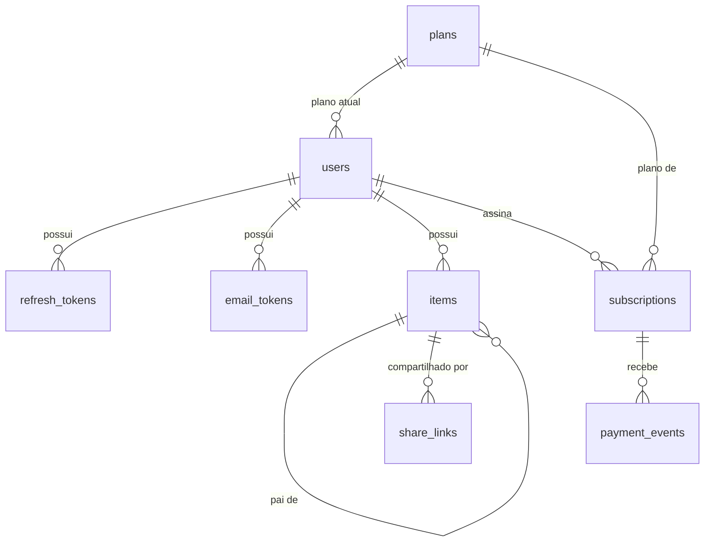
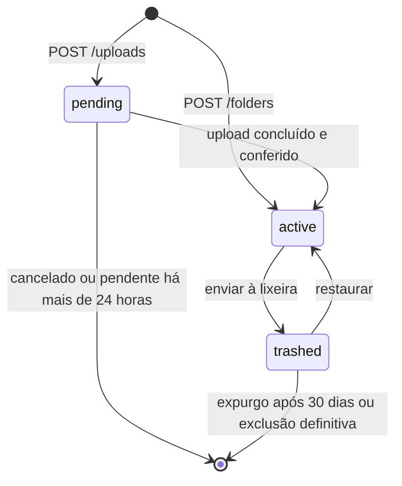
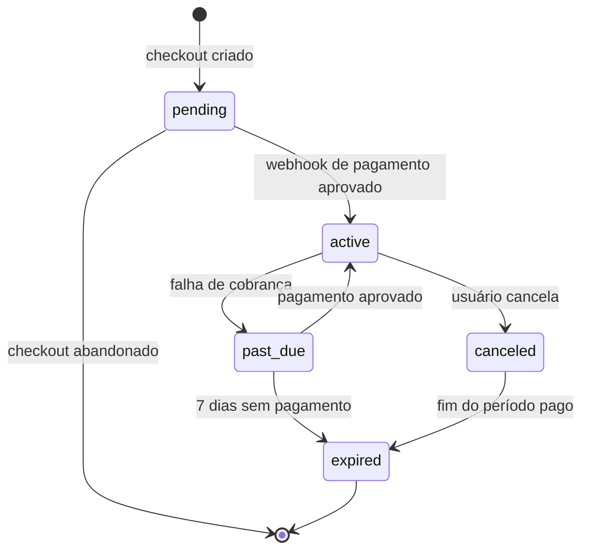

# LLD — Gerenciador de Arquivos (estilo Google Drive)

2026-10-08 · Luiz Carlos · Documentos de origem: [product-brief.md](./product-brief.md) e [hld.md](./hld.md)

Este documento detalha o MVP web no nível necessário para começar a codificar: estrutura do código, esquema do banco, contrato da API, estados e regras, tarefas do worker e configuração. A arquitetura e os motivos das decisões estruturais estão no HLD.

## 1. Estrutura do código

O código fica num monorepo com pnpm workspaces, com dois projetos de deploy independente e um pacote de tipos compartilhados.

```text
/
├── apps/
│   ├── web/                  # Next.js (App Router)
│   │   ├── app/
│   │   │   ├── (auth)/       # login, cadastro, redefinição de senha
│   │   │   ├── (drive)/      # pastas, lixeira, busca, planos
│   │   │   └── s/[token]/    # página pública do link compartilhado
│   │   ├── components/
│   │   │   ├── ui/           # primitivos do design system (botões, campos, menu, diálogo)
│   │   │   └── <domínio>/    # navigation, files, sharing, plans, auth
│   │   ├── lib/api/          # cliente da API, usado só no servidor
│   │   ├── lib/session/      # leitura e renovação dos cookies de token
│   │   ├── lib/dal/          # camada de acesso a dados: confere a Sessão na API
│   │   └── proxy.ts          # renova os cookies e redireciona antes de cada rota
│   └── api/                  # NestJS (API e worker, mesma imagem)
│       ├── prisma/           # schema.prisma e migrações
│       └── src/
│           ├── modules/
│           │   ├── users/    # dono da tabela users e de GET /me
│           │   ├── auth/     # Sessões, tokens de e-mail, cadastro e login
│           │   ├── items/
│           │   ├── uploads/
│           │   ├── sharing/
│           │   ├── quota/
│           │   ├── billing/
│           │   └── worker/   # endpoints internos das tarefas
│           ├── config/       # módulo de config: schema e leitura das variáveis de ambiente
│           ├── infra/        # database (cliente do Prisma), storage, tasks, mail, payment gateway
│           └── common/       # guards, filtros de erro, rate limit
└── packages/
    └── shared/               # tipos do contrato da API e códigos de erro
```

| Decisão | Escolha |
| --- | --- |
| ORM e migrações | Prisma 7, com o driver `pg`. As consultas recursivas de pastas usam SQL puro (`$queryRaw`). O Prisma 8 ainda é release candidate e troca a API do cliente, então a versão fica fixada na 7 até ele estabilizar. |
| Envio de e-mail | nodemailer, por SMTP, atrás da interface de `infra/mail` |
| Validação de entrada | class-validator nos DTOs da API e zod nos formulários da web |
| Configuração da API | `@nestjs/config`, com um schema do Joi que valida as variáveis de ambiente na subida |
| Textos da interface | Só em português, sem biblioteca de tradução |
| Documentação da API | OpenAPI gerado pelo NestJS (Swagger) |
| Autenticação | `@nestjs/jwt` com um guard próprio, sem Passport. Argon2 para o hash da senha. |
| Storage e fila | SDKs oficiais do Google Cloud (Storage e Cloud Tasks) |
| Testes | Vitest na API e Playwright para os fluxos de ponta a ponta |
| Lint e formatação | oxlint e Prettier na API, ESLint na web |

**Práticas de código da API:** as camadas de cada módulo, a direção das dependências, o tratamento de erros, os nomes de arquivos, os níveis de teste e o módulo de config estão no `AGENTS.md` do projeto `api`, e não neste documento.

**Práticas de código da web:** a preferência por Server Components, as regras de cache, o acesso a dados e os formulários estão no `AGENTS.md` do projeto `web`, e não neste documento.

**Chamadas do frontend:** o Next.js chama a API sempre no servidor (Server Components, Server Actions e Route Handlers). O navegador só fala direto com o Cloud Storage, para upload e download.

**IP do usuário:** como as chamadas saem do servidor do Next.js, a API enxergaria o IP da web. A web repassa o IP do navegador no cabeçalho `X-Client-Ip`, junto com o segredo `INTERNAL_API_SECRET` no cabeçalho `X-Internal-Secret`. A API só usa o IP repassado quando o segredo confere. Sem ele, vale o IP da conexão.

**Pacote compartilhado:** o `packages/shared` e o workspace na raiz ainda não existem. Enquanto o contrato for pequeno, cada projeto mantém os próprios tipos. A migração para o workspace exige mudar os volumes e os Dockerfiles do Compose.

## 2. Esquema do banco

**Convenções:** nomes em inglês e `snake_case`, chaves primárias em UUID v7 gerado pela aplicação, tamanhos em `BIGINT` (bytes), datas em `TIMESTAMPTZ` (UTC) e valores monetários em centavos.

**Extensões:** a primeira migração habilita `citext` (texto insensível a maiúsculas, usado no e-mail) e `pg_trgm` (trigramas, usados na busca). Ela não cria nenhuma tabela: cada tabela nasce na migração da funcionalidade dona dela.



### users

| Coluna | Tipo | Observação |
| --- | --- | --- |
| `id` | `UUID` | Chave primária |
| `email` | `CITEXT` | Único |
| `password_hash` | `TEXT` | Argon2id |
| `email_verified_at` | `TIMESTAMPTZ` | Nulo até a verificação |
| `terms_accepted_at` | `TIMESTAMPTZ` | Aceite dos termos e da política de privacidade, gravado no cadastro |
| `plan_id` | `UUID` | Referência a `plans`. Começa no plano gratuito. |
| `used_bytes` | `BIGINT` | Padrão 0. Restrição `used_bytes >= 0`. |
| `created_at`, `updated_at` | `TIMESTAMPTZ` | |

O e-mail é gravado sem os espaços das pontas. O `CITEXT` ignora maiúsculas, e não há outra normalização: `joao+x@gmail.com` e `joao@gmail.com` são usuários diferentes.

`plan_id` e `used_bytes` não fazem parte da primeira migração. Eles são acrescentados, junto com a tabela `plans`, pela funcionalidade de cota.

### refresh_tokens

| Coluna | Tipo | Observação |
| --- | --- | --- |
| `id` | `UUID` | Chave primária |
| `user_id` | `UUID` | Referência a `users`, com exclusão em cascata |
| `session_id` | `UUID` | Agrupa a cadeia de tokens de uma mesma Sessão. Gerado no login. |
| `token_hash` | `TEXT` | SHA-256 do token. Único. |
| `expires_at` | `TIMESTAMPTZ` | 30 dias após a emissão |
| `rotated_at` | `TIMESTAMPTZ` | Preenchido quando o token é trocado |
| `replaced_by_id` | `UUID` | O token que o substituiu |
| `created_at` | `TIMESTAMPTZ` | |

### email_tokens

| Coluna | Tipo | Observação |
| --- | --- | --- |
| `id` | `UUID` | Chave primária |
| `user_id` | `UUID` | Referência a `users`, com exclusão em cascata |
| `type` | `TEXT` | `verify_email` ou `reset_password` |
| `token_hash` | `TEXT` | Único |
| `expires_at` | `TIMESTAMPTZ` | 24 horas para verificação, 1 hora para redefinição |
| `used_at` | `TIMESTAMPTZ` | Uso único |

Emitir um token apaga os anteriores do mesmo usuário e do mesmo tipo. Só o link mais recente funciona.

### items

| Coluna | Tipo | Observação |
| --- | --- | --- |
| `id` | `UUID` | Chave primária |
| `owner_id` | `UUID` | Referência a `users`, com exclusão em cascata |
| `parent_id` | `UUID` | Referência a `items`. Nulo só na pasta raiz. |
| `type` | `TEXT` | `file` ou `folder` |
| `name` | `VARCHAR(255)` | Sem `/` nem caracteres de controle. Nomes duplicados são permitidos. |
| `status` | `TEXT` | `pending`, `active` ou `trashed` |
| `size_bytes` | `BIGINT` | 0 para pastas |
| `mime_type` | `TEXT` | Nulo para pastas |
| `object_key` | `TEXT` | Chave aleatória no bucket. Nulo para pastas. Único. |
| `upload_session_uri` | `TEXT` | Sessão retomável do Cloud Storage, enquanto `pending` |
| `thumbnail_key` | `TEXT` | Nulo se não houver miniatura |
| `trashed_at` | `TIMESTAMPTZ` | Preenchido ao enviar para a lixeira |
| `created_at`, `updated_at` | `TIMESTAMPTZ` | |

**Índices de `items`**

- `(parent_id)` filtrado por `status = 'active'`, para listar uma pasta.
- `(owner_id, status, trashed_at)`, para a lixeira e o expurgo.
- `(status, created_at)` filtrado por `status = 'pending'`, para a limpeza de uploads.
- Trigramas (`pg_trgm`, GIN) em `name`, para a busca.
- Único em `(owner_id)` filtrado por `parent_id IS NULL`, para garantir uma raiz por usuário.

### share_links

| Coluna | Tipo | Observação |
| --- | --- | --- |
| `id` | `UUID` | Chave primária |
| `item_id` | `UUID` | Referência a `items`, com exclusão em cascata |
| `owner_id` | `UUID` | Referência a `users` |
| `token_hash` | `TEXT` | SHA-256 do token do link. Único. |
| `password_hash` | `TEXT` | Argon2id. Nulo se o link não tiver senha. |
| `expires_at` | `TIMESTAMPTZ` | Nulo se o link não expirar |
| `created_at` | `TIMESTAMPTZ` | |

Como só o hash é guardado, a URL do link é exibida uma única vez, na criação. Depois disso, a listagem mostra a data, a expiração e se há senha, mas não a URL.

### plans

| Coluna | Tipo | Observação |
| --- | --- | --- |
| `id` | `UUID` | Chave primária |
| `code` | `TEXT` | `free`, `plan_100gb`, `plan_1tb` ou `plan_2tb`. Único. |
| `storage_bytes` | `BIGINT` | Limite da cota |
| `price_monthly_cents`, `price_yearly_cents` | `INTEGER` | Valores a definir (questão em aberto do brief) |
| `active` | `BOOLEAN` | Plano disponível para contratação |

### subscriptions

| Coluna | Tipo | Observação |
| --- | --- | --- |
| `id` | `UUID` | Chave primária |
| `user_id` | `UUID` | Referência a `users` |
| `plan_id` | `UUID` | Referência a `plans` |
| `status` | `TEXT` | `pending`, `active`, `past_due`, `canceled` ou `expired` |
| `billing_cycle` | `TEXT` | `monthly` ou `yearly` |
| `payment_method` | `TEXT` | `card` ou `pix` |
| `current_period_start`, `current_period_end` | `TIMESTAMPTZ` | |
| `past_due_since` | `TIMESTAMPTZ` | Início da tolerância de 7 dias |
| `gateway_subscription_id` | `TEXT` | Referência no gateway |
| `created_at`, `updated_at` | `TIMESTAMPTZ` | |

Índice único em `(user_id)` filtrado por `status IN ('active', 'past_due', 'canceled')`: cada usuário tem no máximo uma assinatura vigente.

### payment_events

| Coluna | Tipo | Observação |
| --- | --- | --- |
| `id` | `UUID` | Chave primária |
| `gateway_event_id` | `TEXT` | Único. Garante que webhooks reenviados sejam ignorados. |
| `subscription_id` | `UUID` | Nulo se o evento não puder ser associado |
| `type` | `TEXT` | Tipo do evento no gateway |
| `payload` | `JSONB` | Conteúdo recebido |
| `received_at`, `processed_at` | `TIMESTAMPTZ` | |

### rate_limits

| Coluna | Tipo | Observação |
| --- | --- | --- |
| `key` | `TEXT` | Chave primária, por exemplo `login:email:<hash do e-mail>` ou `login:ip:<ip>` |
| `window_start` | `TIMESTAMPTZ` | Início da janela |
| `count` | `INTEGER` | Contador da janela |

Os contadores ficam no PostgreSQL porque as instâncias do Cloud Run não compartilham memória. Uma troca futura por Redis fica restrita ao módulo `common/rate-limit`.

## 3. Contrato da API

### 3.1 Convenções

| Convenção | Escolha |
| --- | --- |
| Prefixo e versão | `/v1` |
| Formato | JSON, com campos em `camelCase` |
| Autenticação | `Authorization: Bearer <token de acesso>` |
| Erros | RFC 9457 (`application/problem+json`), com um campo `code` estável |
| Paginação | Por cursor: `?limit=50&cursor=...`, com máximo de 200. A resposta traz `nextCursor`. |
| Ordenação de listagens | Pastas primeiro, depois por nome |
| Idempotência | Cabeçalho `Idempotency-Key` em `POST /uploads` e `POST /billing/checkout` |

**Códigos de erro**

| HTTP | `code` | Quando |
| --- | --- | --- |
| 400 | `validation_error` | Entrada inválida |
| 400 | `invalid_token` | Token de verificação ou de redefinição inexistente, expirado ou já usado |
| 400 | `invalid_move` | Mover uma pasta para dentro dela mesma ou de uma descendente |
| 400 | `max_depth_exceeded` | Mais de 50 níveis de pastas |
| 401 | `unauthenticated` | Token ausente, inválido ou expirado |
| 401 | `invalid_credentials` | E-mail ou senha incorretos |
| 403 | `email_not_verified` | Login antes da verificação do e-mail |
| 403 | `link_password_required` | Link com senha, sem token de acesso ao link |
| 404 | `not_found` | Item inexistente ou de outro dono |
| 409 | `upload_size_mismatch` | Tamanho real diferente do declarado |
| 410 | `link_expired` | Link expirado ou revogado |
| 413 | `file_too_large` | Arquivo acima de 5 GB |
| 413 | `quota_exceeded` | Sem espaço no plano |
| 429 | `rate_limited` | Limite de requisições atingido |
| 500 | `internal_error` | Falha não prevista. A resposta não traz mensagem interna nem stack trace. |

**Corpo do erro**

Todo erro sai com `Content-Type: application/problem+json` e este corpo:

```json
{
  "type": "about:blank",
  "title": "Bad Request",
  "status": 400,
  "code": "validation_error",
  "detail": "A entrada é inválida.",
  "errors": [{ "field": "email", "messages": ["email must be an email"] }]
}
```

| Campo | Conteúdo |
| --- | --- |
| `type` | Sempre `about:blank`. Quem identifica o erro é o `code`. |
| `title` | O nome padrão do status HTTP |
| `status` | O mesmo status da resposta |
| `code` | O código estável da tabela acima. É o único campo que a web usa para decidir a mensagem. |
| `detail` | Texto de apoio para quem desenvolve. Só aparece nos erros de regra de negócio e de validação. |
| `errors` | Só em `validation_error` de um corpo que não passou na validação: um item por campo, com o caminho do campo (`address.city` nos aninhados) e as mensagens |

- **Rota inexistente:** responde 404 com `not_found`.
- **Corpo malformado:** um JSON que não pode ser lido responde 400 com `validation_error`, sem `errors`.
- **Campos desconhecidos:** os campos que a rota não declara são descartados, sem erro.
- **Outros erros do framework:** um status que não está na tabela (405, 415 etc.) usa como `code` o nome do status em `snake_case`, por exemplo `method_not_allowed`.
- **Erro 5xx lançado de propósito:** quando o código responde de propósito com 501, 502, 503 ou 504, o status é mantido e o `code` é o nome dele (`service_unavailable`). A resposta continua sem `detail`, e a falha vai para o log.
- **Erro de terceiros:** só o que o framework levanta escolhe o status. Um erro de uma biblioteca ou do SDK de um fornecedor é sempre `internal_error`, mesmo que ele traga um status próprio.
- **Falha depois de a resposta começar:** se o erro acontece com a resposta já em envio, não dá mais para mandar o corpo de erro. A API registra a falha e derruba a conexão, para o cliente perceber que a resposta veio incompleta.

### 3.2 Autenticação e conta

| Método e rota | Entrada | Saída |
| --- | --- | --- |
| `POST /auth/register` | `email`, `password` | 201, mesmo se o e-mail já existir. Envia um e-mail, que varia conforme o caso (seção 4.7). |
| `POST /auth/verify-email` | `token` | 204. Não abre Sessão. |
| `POST /auth/resend-verification` | `email` | 204, mesmo se o e-mail não existir ou já estiver verificado |
| `POST /auth/login` | `email`, `password` | `accessToken`, `refreshToken`, `expiresIn` |
| `POST /auth/refresh` | `refreshToken` | Novo par de tokens |
| `POST /auth/logout` | `refreshToken` | 204, mesmo com token inválido ou expirado. Encerra a Sessão do token. |
| `POST /auth/logout-all` | | 204. Encerra todas as Sessões do usuário. |
| `POST /auth/forgot-password` | `email` | 204, mesmo se o e-mail não existir |
| `POST /auth/reset-password` | `token`, `password` | 204. Encerra todas as Sessões e não abre uma nova. |
| `GET /me` | | `id`, `email`, `plan`, `usedBytes`, `quotaBytes`, `readOnly` |
| `PATCH /me/password` | `currentPassword`, `newPassword` | 204. Encerra as outras Sessões. |

`GET /me` pertence ao módulo `users`. Até a funcionalidade de cota existir, ele devolve só `id` e `email`. `POST /auth/logout-all` e `PATCH /me/password` dependem de uma tela de conta e não fazem parte da primeira entrega de autenticação.

### 3.3 Itens, lixeira e busca

| Método e rota | Entrada | Saída |
| --- | --- | --- |
| `GET /items/{id}` | | O item e a trilha de pastas até a raiz |
| `GET /items/{id}/children` | `limit`, `cursor` | Lista de itens ativos da pasta |
| `POST /folders` | `name`, `parentId` | 201, a pasta criada |
| `PATCH /items/{id}` | `name` e/ou `parentId` | O item atualizado |
| `DELETE /items/{id}` | | 204. Envia para a lixeira. |
| `GET /trash` | `limit`, `cursor` | Itens enviados diretamente à lixeira |
| `POST /items/{id}/restore` | | O item restaurado |
| `DELETE /trash/{id}` | | 202. Exclusão definitiva, em segundo plano. |
| `DELETE /trash` | | 202. Esvazia a lixeira, em segundo plano. |
| `GET /search` | `q` (mínimo de 2 caracteres), `limit`, `cursor` | Itens ativos cujo nome contém `q` |

O id `root` é aceito como atalho para a pasta raiz do usuário.

### 3.4 Upload e download

| Método e rota | Entrada | Saída |
| --- | --- | --- |
| `POST /uploads` | `name`, `sizeBytes`, `mimeType`, `parentId` | 201: `itemId`, `uploadUrl`, `expiresAt` |
| `GET /uploads/{itemId}` | | `itemId`, `uploadUrl`, `expiresAt`, para retomar um upload `pending` |
| `POST /uploads/{itemId}/complete` | | O item, já `active` |
| `DELETE /uploads/{itemId}` | | 204. Cancela e devolve o espaço. |
| `GET /items/{id}/download-url` | `disposition` (`attachment` ou `inline`) | `url`, `expiresAt` |
| `GET /items/{id}/thumbnail-url` | | `url`, `expiresAt`, ou 404 se não houver miniatura |

### 3.5 Compartilhamento

| Método e rota | Entrada | Saída |
| --- | --- | --- |
| `POST /items/{id}/share-links` | `expiresAt` e `password`, opcionais | 201: o link e o `token`, exibido só nesta resposta |
| `GET /items/{id}/share-links` | | Links do item, sem o token |
| `DELETE /share-links/{id}` | | 204 |
| `POST /public/links/{token}/access` | `password`, se o link exigir | Dados do item raiz do link e um `linkAccessToken` de 15 minutos |
| `GET /public/links/{token}/children` | `itemId`, `limit`, `cursor` | Itens ativos abaixo do item do link |
| `GET /public/links/{token}/items/{id}/download-url` | | `url`, `expiresAt` |

As rotas `/public` não exigem conta. Quando o link tem senha, as chamadas seguintes carregam o `linkAccessToken` no cabeçalho `Authorization`.

### 3.6 Cobrança

| Método e rota | Entrada | Saída |
| --- | --- | --- |
| `GET /plans` | | Planos ativos, com espaço e preços |
| `POST /billing/checkout` | `planCode`, `billingCycle`, `paymentMethod` | `checkoutUrl` |
| `GET /billing/subscription` | | A assinatura vigente, ou `null` |
| `POST /billing/subscription/cancel` | | A assinatura, com status `canceled` |
| `POST /webhooks/payments` | Evento do gateway | 200. Valida a assinatura do gateway, sem JWT. |

## 4. Estados e regras

### 4.1 Item



- **Enviar uma pasta à lixeira** marca só a pasta. Os descendentes continuam `active`, mas ficam inacessíveis.
- **Consequência para busca e links públicos:** como os descendentes não são marcados, essas consultas precisam conferir se algum ancestral está na lixeira. A conferência é feita com uma consulta recursiva sobre a página de resultados (até 200 itens, até 50 níveis).
- **Restaurar** devolve o item à pasta de origem. Se ela não existir mais ou estiver na lixeira, o item volta para a raiz.
- **Expurgo de uma pasta** remove todos os descendentes, de baixo para cima.
- **Mover:** a API sobe pelos ancestrais do destino e rejeita o pedido se encontrar o próprio item (`invalid_move`) ou se a profundidade passar de 50 níveis.

### 4.2 Cota

A reserva é um único comando, sem bloqueio explícito:

```sql
UPDATE users u
SET used_bytes = u.used_bytes + $size
FROM plans p
WHERE u.id = $user_id
  AND p.id = u.plan_id
  AND u.used_bytes + $size <= p.storage_bytes;
```

Se nenhuma linha for afetada, a API responde `quota_exceeded`. A reserva e a criação do item `pending` ocorrem na mesma transação.

| Evento | Efeito em `used_bytes` |
| --- | --- |
| Iniciar upload | Soma o tamanho declarado |
| Cancelar upload ou limpeza de pendente | Subtrai |
| Tamanho real diferente do declarado | Subtrai, e o objeto é apagado |
| Enviar à lixeira ou restaurar | Nenhum |
| Expurgo ou exclusão definitiva | Subtrai, depois de o objeto ser apagado do storage |

Pastas e miniaturas não contam para a cota. Uma rotina diária recalcula `used_bytes` pela soma dos itens e registra as divergências.

**Conta somente leitura:** é um estado calculado (`used_bytes > storage_bytes`), não gravado. Ele bloqueia apenas o upload. Baixar, excluir, criar pastas e restaurar da lixeira continuam funcionando.

### 4.3 Assinatura



- **Ativação:** só o webhook de pagamento aprovado muda `users.plan_id`. O retorno do navegador após o checkout não altera nada.
- **Cancelamento:** o plano continua até `current_period_end`, sem reembolso proporcional.
- **Expiração:** `users.plan_id` volta ao plano gratuito. Nenhum arquivo é apagado, e a conta fica somente leitura se estiver acima da cota.
- **Webhook:** a API grava o evento em `payment_events` antes de processar. Se `gateway_event_id` já existir, o evento é ignorado e a resposta é 200.

### 4.4 Permissão

- **Dono:** toda consulta filtra por `owner_id`. Não há acesso a item de outro usuário no MVP.
- **Item inexistente ou de outro dono:** a resposta é 404 nos dois casos.
- **Link público:** dá leitura ao item do link e aos descendentes ativos dele. A cada chamada, a API confere que o item pedido está abaixo do item do link.
- **Item na lixeira:** os links para ele, ou para algo abaixo dele, respondem `link_expired` até a restauração.

### 4.5 Tokens

- **Token de acesso:** JWT com `sub` (id do usuário) e `exp`, assinado com RS256 e validado só pela assinatura.
- **Token de renovação:** valor opaco de 256 bits, guardado só como hash. Cada renovação emite um novo par e marca o token antigo como trocado.
- **Sessão:** é o login de um usuário em um navegador. Todos os tokens de renovação emitidos a partir de um mesmo login carregam o mesmo `session_id`. Sair apaga todos os tokens da Sessão. Não há limite de Sessões simultâneas por usuário.
- **Reuso de um token já trocado:** todas as Sessões do usuário são encerradas, por indicar possível roubo. Para não derrubar requisições que renovam ao mesmo tempo, o token antigo continua aceito por 10 segundos depois da troca.
- **Renovações simultâneas:** dentro dos 10 segundos, cada chamada com o token antigo recebe um par novo e válido, na mesma Sessão. A cadeia bifurca, o último cookie gravado vence e os tokens que sobram expiram sozinhos.
- **Cookies no Next.js:** os dois tokens ficam em cookies `HttpOnly`, `Secure` e `SameSite=Lax`. O `Secure` é desligado por `COOKIE_SECURE=false` no ambiente local, que usa HTTP.
- **Renovação no `proxy.ts`:** antes de cada rota, o Proxy lê o `exp` do token de acesso, sem conferir a assinatura. Se ele expirou, o Proxy chama `/auth/refresh` e regrava os cookies. Se a renovação falha, ele apaga os cookies e redireciona para o login, com o aviso "Sua sessão expirou". O Proxy também manda para o login quem não tem Sessão e tira das telas `(auth)` quem tem.
- **Verificação na web:** a web não tem a chave pública nem valida o JWT. Toda página e Server Action protegida passa pela camada de acesso a dados (`lib/dal`), que chama `GET /me`. Um `401` ali derruba a Sessão. O Proxy é só um filtro otimista, nunca a única barreira.
- **Volta ao destino:** quem é barrado numa rota protegida volta para ela depois de entrar. O destino só aceita caminhos internos.

### 4.6 Upload em chunks

O navegador envia cada arquivo em chunks sequenciais para a sessão de upload retomável do Cloud Storage. A API só participa no início e na conclusão.

| Parâmetro | Valor |
| --- | --- |
| Tamanho do chunk | 8 MiB (o Cloud Storage exige múltiplos de 256 KiB, exceto no último chunk) |
| Arquivos menores que 8 MiB | Enviados num único `PUT` |
| Chunks de um mesmo arquivo | Em sequência, um por vez |
| Arquivos simultâneos | Até 3 |
| Tentativas por chunk | 5, com espera crescente de 1 a 30 segundos |

**Envio**

1. O navegador chama `POST /uploads` e recebe `itemId` e `uploadUrl`.
2. Para cada chunk, o navegador faz um `PUT` em `uploadUrl` com o cabeçalho `Content-Range: bytes <início>-<fim>/<total>`.
3. O storage responde `308` enquanto faltam bytes, com o cabeçalho `Range` indicando o que já foi recebido. O navegador calcula o próximo chunk a partir desse valor, e não do que ele acha que enviou.
4. No último chunk, o storage responde `200` ou `201`. O navegador chama `POST /uploads/{itemId}/complete`.

**Retomada**

1. Depois de uma falha de rede, o navegador faz um `PUT` vazio com `Content-Range: bytes */<total>`.
2. O storage responde `308` com o cabeçalho `Range`. Sem esse cabeçalho, nenhum byte foi recebido.
3. O navegador continua a partir do byte seguinte.

**Depois de fechar a aba**

- O navegador guarda no `localStorage` só o `itemId` e uma impressão do arquivo (nome, tamanho e data de modificação). A `uploadUrl` não é guardada, porque quem a tem consegue gravar na sessão.
- Ao voltar, a interface lista os uploads incompletos e pede que o usuário selecione o arquivo de novo, já que o navegador não mantém acesso ao arquivo local.
- Se a impressão bater, o navegador chama `GET /uploads/{itemId}` para obter a `uploadUrl` e retoma pelo passo de retomada.

**Erros**

| Situação | Tratamento |
| --- | --- |
| `5xx` ou falha de rede | Consultar o progresso e repetir o chunk, até 5 vezes |
| `404` ou `410` na sessão | A sessão expirou. O navegador chama `DELETE /uploads/{itemId}` e recomeça do zero. |
| `upload_size_mismatch` na conclusão | A API apaga o objeto e devolve o espaço. O navegador mostra o erro. |
| Usuário cancela | O navegador chama `DELETE /uploads/{itemId}` |

**Pontos de implementação a validar**

- **Origem na criação da sessão:** a API precisa informar a origem do frontend ao criar a sessão retomável, para que o navegador possa usá-la.
- **CORS do bucket:** a configuração precisa expor o cabeçalho `Range` na resposta, para o navegador conseguir lê-lo.

Esses dois pontos vêm do meu conhecimento da API do Cloud Storage e não foram testados neste projeto. Vale confirmá-los na documentação atual antes de implementar.

### 4.7 Cadastro, verificação e senha

**Cadastro**

O cadastro nunca revela se um e-mail já tem usuário. A resposta é sempre 201, e o que muda é o e-mail enviado.

| Situação do e-mail | Efeito | E-mail enviado |
| --- | --- | --- |
| Novo | Cria o usuário, não verificado | Verificação |
| Já cadastrado, não verificado | Substitui a senha pela nova e invalida os links anteriores | Verificação |
| Já cadastrado e verificado | Nenhum | "Você já tem conta", com os caminhos para entrar e redefinir a senha |

- **O último cadastro vence:** sem isso, quem cadastrasse primeiro o e-mail de outra pessoa ficaria com a senha de um usuário que ela mesma verificaria depois.
- **Risco residual aceito:** se um estranho se cadastrar depois do dono e o dono clicar no link do estranho, o usuário fica verificado com a senha do estranho. O usuário ainda está vazio, o dono não consegue entrar e usa "esqueci a senha", que troca a senha e encerra todas as Sessões.
- **Aceite dos termos:** a tela mostra a frase de aceite com os links, sem checkbox, e o cadastro grava `terms_accepted_at`.

**Verificação de e-mail**

- Usuário não verificado não entra: o login responde `email_not_verified`. Não há Sessão limitada.
- Verificar não abre Sessão. O usuário é levado ao login, com um aviso de sucesso.
- O reenvio emite um novo token e invalida o anterior.

**Redefinição de senha**

- Funciona também para usuário não verificado.
- Concluir a redefinição marca o e-mail como verificado, porque a pessoa provou que controla a caixa.
- Encerra todas as Sessões, não abre uma nova e envia o e-mail "sua senha foi alterada".

**Limite de tentativas**

- A chave "por conta" é o hash do e-mail digitado, exista ou não o usuário. Assim o bloqueio não revela quem tem cadastro.
- Estourado o limite, a resposta é `rate_limited` até a janela fechar, mesmo com a senha certa. Um terceiro consegue travar o login de alguém por 15 minutos; o MVP aceita esse risco.

**Envio de e-mail**

- A API envia por SMTP, atrás da interface de `infra/mail`, e responde sem esperar o envio terminar. Isso também evita que o tempo de resposta revele se o e-mail existe.
- Uma falha de envio só é registrada em log. O usuário usa o reenvio.
- Os e-mails são de texto simples com a marca, sem desenho no Figma.

## 5. Tarefas do worker

O worker é a mesma imagem da API, publicada como um serviço separado do Cloud Run. Ele expõe endpoints HTTP internos, que só aceitam chamadas autenticadas (OIDC) do Cloud Tasks e do Cloud Scheduler. Todas as tarefas são idempotentes.

| Tarefa | Disparo | Em caso de falha |
| --- | --- | --- |
| Gerar miniatura de imagem | Cloud Tasks, na conclusão do upload | 3 tentativas. Depois disso, o arquivo fica sem miniatura. |
| Limpar uploads `pending` há mais de 24 horas | Cloud Scheduler, a cada hora | Tenta de novo na próxima execução |
| Expurgar itens há mais de 30 dias na lixeira | Cloud Scheduler, diário | Tenta de novo na próxima execução |
| Apagar objetos no Cloud Storage | Cloud Tasks, uma tarefa por lote | Novas tentativas com espera crescente |
| Gerar cobrança Pix | Cloud Scheduler, diário, 5 dias antes do vencimento | Nova tentativa e alerta |
| Expirar assinaturas `past_due` há mais de 7 dias e `canceled` com período encerrado | Cloud Scheduler, diário | Tenta de novo na próxima execução |
| Reconciliar `used_bytes` | Cloud Scheduler, diário | Só registra a divergência |
| Limpar tokens, links e contadores expirados | Cloud Scheduler, diário | Tenta de novo na próxima execução |

**Ordem do expurgo:** primeiro o objeto e a miniatura são apagados do Cloud Storage, e só depois a linha sai do banco e o espaço volta à cota. Na ordem inversa, uma falha no meio deixaria objetos órfãos, gerando custo sem registro.

**Miniaturas:** são geradas só para imagens de até 50 MB, com 320 px no lado maior, em WebP, e gravadas no mesmo bucket sob o prefixo `thumbnails/`.

## 6. Configuração e segurança

**Limites e prazos**

| Item | Valor |
| --- | --- |
| Token de acesso | 15 minutos |
| Token de renovação | 30 dias, com rotação a cada uso |
| Token de acesso a link com senha | 15 minutos |
| Senha | De 10 a 128 caracteres, sem regra de composição, com hash Argon2id |
| Tentativas de login | 5 por e-mail e 20 por IP a cada 15 minutos |
| Cadastro, reenvio de verificação e "esqueci a senha" | 3 por e-mail e 10 por IP a cada hora |
| Tentativas de senha de link público | 10 por link a cada 15 minutos |
| Limite geral da API | 300 requisições por minuto por usuário |
| Tamanho máximo por arquivo | 5 GB |
| URL assinada de download | 5 minutos |
| Sessão de upload retomável | 24 horas |
| Retenção da lixeira | 30 dias |
| Tolerância de pagamento | 7 dias |
| Profundidade de pastas | 50 níveis |

A retenção da lixeira, o prazo de upload pendente e a validade dos tokens são lidos de variáveis de ambiente. Os valores da tabela são os padrões de produção, e o ambiente local pode reduzi-los para testar.

**CORS**

- **API:** só a origem do frontend.
- **Bucket:** só a origem do frontend, para os métodos de upload e download.

**Variáveis de ambiente**

| Variável | Projeto | Conteúdo |
| --- | --- | --- |
| `PORT` | api | Porta HTTP, com padrão 3000. O Cloud Run a define em produção. |
| `DATABASE_URL` | api | Conexão com o Cloud SQL (segredo). No desenvolvimento, aponta para o `postgres`. |
| `JWT_PRIVATE_KEY`, `JWT_PUBLIC_KEY` | api | Par de chaves RSA do RS256, em PEM (segredo). São aceitos os formatos PKCS#8, SPKI e PKCS#1. |
| `GCS_BUCKET` | api | Nome do bucket privado |
| `TASKS_QUEUE`, `WORKER_URL` | api | Fila do Cloud Tasks e endereço do worker |
| `QUEUE_DRIVER` | api | `cloud-tasks` em staging e produção, `local` no desenvolvimento (chamada HTTP direta ao worker) |
| `STORAGE_EMULATOR_HOST` | api | Endereço do emulador de storage, só no desenvolvimento |
| `TRASH_RETENTION_DAYS`, `PENDING_UPLOAD_TTL_HOURS` | api | Padrões de 30 dias e 24 horas |
| `ACCESS_TOKEN_TTL`, `REFRESH_TOKEN_TTL` | api | Padrões de 15 minutos e 30 dias |
| `PAYMENT_API_KEY`, `PAYMENT_WEBHOOK_SECRET` | api | Credenciais do gateway (segredo) |
| `SMTP_URL`, `MAIL_FROM` | api | Servidor SMTP do serviço de e-mail (segredo) e remetente. No desenvolvimento, aponta para o `mailpit`. |
| `SMTP_TIMEOUT_MS` | api | Quanto esperar o servidor SMTP para resolver o nome, conectar, saudar e responder, em milissegundos. Padrão de 10000. |
| `WEB_ORIGIN` | api | Origem do frontend, para CORS e links de e-mail |
| `INTERNAL_API_SECRET` | api e web | Segredo que autoriza a web a repassar o IP do usuário (segredo) |
| `API_URL` | web | Endereço interno da API |
| `COOKIE_DOMAIN` | web | Domínio dos cookies de token |
| `COOKIE_SECURE` | web | Padrão `true`. `false` só no desenvolvimento, que usa HTTP. |

**Validação na subida:** a API valida as próprias variáveis ao iniciar e não sobe se alguma obrigatória faltar ou vier inválida. Hoje o schema cobre `PORT`, `DATABASE_URL`, `JWT_PRIVATE_KEY`, `JWT_PUBLIC_KEY`, `SMTP_URL`, `MAIL_FROM` e `SMTP_TIMEOUT_MS`, e todas, menos `PORT` e `SMTP_TIMEOUT_MS`, são obrigatórias. As chaves do JWT são lidas de verdade na validação: uma chave que não é RSA, ou que não pode ser lida, impede a subida. Cada uma das outras variáveis da tabela entra no schema e no `.env.example` junto com a funcionalidade que a usa.

**Ambiente local:** as variáveis da API ficam em `apps/api/.env`, fora do Git. Na primeira subida, o contêiner da API cria esse arquivo como cópia do `apps/api/.env.example`, que é versionado e funciona sem alterações, e um script gera as chaves do JWT e as grava nele. Os hosts são sempre os nomes dos serviços do Compose.

**Banco de testes:** os testes da API usam um banco separado no mesmo PostgreSQL, com o nome do banco de `DATABASE_URL` mais o sufixo `_test`. Ele não tem variável própria.

Os valores marcados como segredo vêm do Secret Manager e não ficam em arquivos versionados.

## Questões em aberto

- [ ] Exclusão de conta pelo próprio usuário: está fora do MVP, mas a LGPD dá ao titular o direito de pedir a eliminação dos dados. Sem a função, o pedido é atendido manualmente.
- [ ] Texto dos Termos e da Política de Privacidade: depende de validação jurídica. Até lá, os links do cadastro apontam para páginas provisórias.
- [ ] Troca de e-mail pelo próprio usuário e lista de Sessões ativas: fora do MVP.
- [ ] Limpeza de usuários nunca verificados: sem rotina por enquanto. Eles não bloqueiam o cadastro do dono do e-mail.
- [ ] Captcha no cadastro e checagem da senha contra listas de senhas vazadas: fora do MVP.
- [ ] Download de pasta inteira em ZIP: fica fora do MVP, e o usuário baixa arquivo por arquivo.
- [ ] Operações em lote (mover ou excluir vários itens): o frontend faz uma chamada por item.
- [ ] Direito de arrependimento de 7 dias em compras online: precisa de validação jurídica e pode exigir reembolso.
- [ ] URL do link compartilhado visível só na criação: confirmar se esse comportamento é aceitável, ou guardar o token de forma recuperável.
- [ ] Preços dos planos, gateway de pagamento e serviço de e-mail, que continuam em aberto no brief e no HLD.
