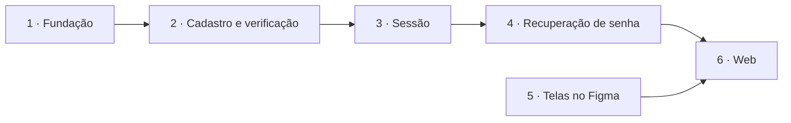

# Plano — Funcionalidade 01: cadastro e login

2026-10-08 · Luiz Carlos · Documentos de origem: [product-brief.md](../product-brief.md), [hld.md](../hld.md), [lld.md](../lld.md) e [design-system.md](../design-system.md)

Este plano define a ordem de execução da funcionalidade 01 e o que prova que cada fatia está pronta. O contrato, o esquema e as regras estão no LLD, que continua sendo a fonte da verdade. Os termos **Usuário** e **Sessão** seguem o [GLOSSARY.md](../../GLOSSARY.md).

## Escopo

**Entra**

- Cadastro com e-mail e senha, com aceite dos termos.
- Verificação de e-mail, com reenvio.
- Login, renovação da Sessão e logout.
- Esqueci a senha e redefinição, com o aviso "sua senha foi alterada".
- `GET /me`, devolvendo `id` e `email`.
- A fundação que essas rotas exigem: banco, e-mail, variáveis de ambiente, erros e limite de tentativas.

**Fica de fora**

- `PATCH /me/password` e `POST /auth/logout-all`, que dependem de uma tela de conta.
- `plan_id`, `used_bytes` e a tabela `plans`, que entram com a funcionalidade de cota.
- A pasta raiz do Usuário, criada sob demanda pelo módulo `items`.
- O workspace na raiz e o `packages/shared`.
- Os serviços `storage` e `worker` do Compose.
- Troca de e-mail, exclusão do Usuário, lista de Sessões, captcha e checagem de senhas vazadas.

## Ordem das fatias

As fatias 1 a 4 são da API e seguem em sequência. A fatia 5 corre em paralelo com elas. A fatia 6 só começa com o contrato implementado e as telas aprovadas.

Toda fatia de código termina com a definição de pronto do `AGENTS.md`: suíte de testes completa, `tsc --noEmit` e lint, tudo dentro do contêiner.

## Fatia 1 — Fundação

**O que entrega**

- Serviços `postgres` e `mailpit` no `compose.dev.yaml`.
- Prisma na API, com as migrações aplicadas quando o contêiner sobe e as extensões `citext` e `pg_trgm` habilitadas.
- `.env.example` versionado, com valores que funcionam localmente e hosts pelo nome do serviço do Compose.
- Script que gera o par de chaves RS256 na primeira subida e o grava no `.env`.
- Prefixo `/v1`, validação global dos DTOs e filtro de erro no formato RFC 9457, com o campo `code`.
- Módulo `common/rate-limit`, com os contadores na tabela `rate_limits`.
- Leitura do IP do usuário: `X-Client-Ip` só vale com o `INTERNAL_API_SECRET` correto.
- Interface de `infra/mail` com o driver SMTP, apontado para o Mailpit.
- Banco `app_test` no mesmo `postgres`, limpo a cada arquivo de teste de integração.

**Critérios de aceite**

- `docker compose -f compose.dev.yaml up -d --build` sobe os quatro serviços e aplica as migrações sem passo manual.
- Uma entrada inválida numa rota de exemplo devolve `application/problem+json` com `code: validation_error`.
- O limite de tentativas bloqueia na requisição seguinte ao teto e libera quando a janela fecha (teste de integração).
- Uma chamada com `X-Client-Ip` e sem o segredo usa o IP da conexão (teste de integração).
- Um e-mail enviado pela interface de `infra/mail` aparece no Mailpit.

## Fatia 2 — Cadastro e verificação

**O que entrega**

- Módulo `users`, dono da tabela `users` (sem `plan_id` nem `used_bytes`, com `terms_accepted_at`).
- Tabela `email_tokens`.
- `POST /auth/register`, `POST /auth/verify-email` e `POST /auth/resend-verification`.
- E-mails de verificação e de "você já tem conta".

**Critérios de aceite**

- O cadastro responde 201 nos três casos: e-mail novo, não verificado e já verificado.
- E-mail novo cria o Usuário não verificado, com `terms_accepted_at` preenchido e a senha em Argon2id.
- Cadastrar de novo um e-mail não verificado substitui a senha e invalida o link anterior.
- Cadastrar um e-mail já verificado não altera o Usuário e envia o e-mail "você já tem conta".
- O link de verificação funciona uma vez só. Token inexistente, expirado ou já usado devolve `invalid_token`.
- O reenvio responde 204 para e-mail inexistente e para e-mail já verificado, sem enviar verificação.
- Senha com menos de 10 ou mais de 128 caracteres devolve `validation_error`.
- `Maria@X.com` e `maria@x.com` são o mesmo Usuário. `maria+a@x.com` é outro.
- O quarto cadastro do mesmo e-mail em uma hora devolve `rate_limited`.
- O módulo `auth` não acessa a tabela `users` diretamente, só pelo `UsersService`.

## Fatia 3 — Sessão

**O que entrega**

- Tabela `refresh_tokens`, com `session_id`.
- `POST /auth/login`, `POST /auth/refresh` e `POST /auth/logout`.
- Guard do JWT (RS256, validado só pela assinatura).
- `GET /me` no módulo `users`.

**Critérios de aceite**

- Login com credenciais certas e e-mail verificado devolve o par de tokens.
- Senha errada e e-mail inexistente devolvem o mesmo `invalid_credentials`.
- Usuário não verificado recebe `email_not_verified`.
- A sexta tentativa de login para o mesmo e-mail em 15 minutos devolve `rate_limited`, exista ou não o Usuário, e mesmo com a senha certa.
- A renovação emite um par novo, com o mesmo `session_id`, e marca o token antigo como trocado.
- O token antigo, usado de novo dentro de 10 segundos, recebe outro par válido.
- O token antigo, usado depois de 10 segundos, encerra todas as Sessões do Usuário.
- O logout apaga todos os tokens da Sessão, inclusive os ramos de renovações simultâneas, e mantém as outras Sessões.
- O logout com token inválido ou expirado responde 204.
- `GET /me` devolve `id` e `email` com token válido, e `unauthenticated` sem token, com token expirado ou com assinatura inválida.

## Fatia 4 — Recuperação de senha

**O que entrega**

- `POST /auth/forgot-password` e `POST /auth/reset-password`.
- E-mails de redefinição e de "sua senha foi alterada".

**Critérios de aceite**

- `forgot-password` responde 204 para e-mail existente e inexistente, e só envia e-mail no primeiro caso.
- A resposta não espera o envio do e-mail.
- Pedir um novo link invalida o anterior.
- O link vale 1 hora e funciona uma vez só. Fora disso, devolve `invalid_token`.
- A redefinição troca a senha, encerra todas as Sessões e não abre uma nova.
- A redefinição de um Usuário não verificado também marca o e-mail como verificado.
- O e-mail "sua senha foi alterada" é enviado depois da redefinição.

## Fatia 5 — Telas no Figma

Segue o fluxo de trabalho do `docs/design-system.md`, que é obrigatório para esta fatia.

**O que entrega**

Os estados do `auth-card`, em desktop e mobile:

- Entrar, com os avisos "e-mail verificado", "senha redefinida" e "sua sessão expirou", e os erros de credenciais, e-mail não verificado (com a ação de reenviar) e limite de tentativas.
- Criar conta, com a frase de aceite dos termos e os erros por campo.
- Confira seu e-mail, com a ação de reenviar.
- Link inválido ou expirado, para verificação e para redefinição.
- Esqueci minha senha e a confirmação de envio.
- Nova senha.

**Critérios de aceite**

- Todas as telas usam só tokens e componentes do design system.
- As telas foram aprovadas antes do início da fatia 6.

A página provisória pós-login e os e-mails transacionais não têm tela no Figma.

## Fatia 6 — Web

**O que entrega**

- Os primitivos de `components/ui/` que a autenticação usa (`text-field`, `password-field`, `button-primary`, `text-link` e `banner`) e o `auth-card` em `components/auth/`.
- As telas do grupo `(auth)`, com Server Actions, `useActionState` e validação em zod.
- `lib/api` (cliente da API, só no servidor, repassando o IP do usuário e o segredo interno), `lib/session` (cookies) e `lib/dal` (confere a Sessão por `GET /me`).
- `proxy.ts`: renova os cookies, protege as rotas e tira das telas `(auth)` quem já tem Sessão.
- Página provisória em `/`, com o e-mail do Usuário e o botão "Sair". Ela é substituída pela listagem de arquivos na funcionalidade 03.
- Páginas provisórias dos Termos e da Política de Privacidade.
- Serviço `e2e` no Compose, com o Playwright.

Antes de escrever código, leia os guias do Next.js em `apps/web/node_modules/next/dist/docs/`, como pede o `apps/web/AGENTS.md`. O `middleware` foi renomeado para `proxy`.

**Critérios de aceite**

- Teste de ponta a ponta no Playwright: cadastro, leitura do link no Mailpit, verificação, login, página provisória com o e-mail e logout.
- Teste de ponta a ponta: esqueci a senha, leitura do link no Mailpit, nova senha e login com ela.
- Quem acessa uma rota protegida sem Sessão vai para o login e, depois de entrar, volta à rota pedida. Um destino externo é ignorado.
- Quem tem Sessão e acessa `/login` é levado para `/`.
- Com o token de acesso expirado e o de renovação válido, a navegação segue sem passar pelo login.
- Com a Sessão revogada, os cookies são apagados e o login mostra "Sua sessão expirou".
- Os tokens não aparecem para o JavaScript da página: os cookies são `HttpOnly`.
- Os erros da API aparecem em português: os de campo junto ao campo, e os demais no `banner` acima do formulário.
- A validação visual do `docs/design-system.md` foi feita contra as telas do Figma.

## Antes de começar

- A `main` só tem o primeiro commit. A `feature/projeto-web` precisa ser integrada por pull request, e a `feature/auth` nasce da `main` atualizada.
