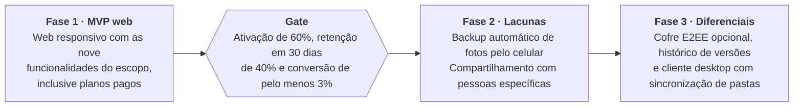

# Product Brief — Gerenciador de Arquivos (estilo Google Drive)

2026-10-08 · Luiz Carlos

## Visão geral

Gerenciador de arquivos na nuvem no estilo Google Drive, para usuários finais, com 15 GB gratuitos e planos pagos de armazenamento adicional. Ele se diferencia por três promessas: privacidade, simplicidade e preço.

- **Privacidade:** criptografia em trânsito (TLS) e em repouso, sem anúncios, sem venda de dados e sem análise do conteúdo, em conformidade com a LGPD. O servidor tecnicamente consegue ler os arquivos; a promessa é sustentada por política e auditoria de acesso. Um cofre com criptografia ponta a ponta (E2EE) opcional fica para uma fase posterior.
- **Simplicidade:** experiência mais enxuta que a dos concorrentes (detalhes a definir no escopo do MVP).
- **Preço:** planos pagos mais acessíveis que os dos concorrentes (faixas e valores a definir).

## Problema e contexto

Quem passa dos 15 GB gratuitos do Google ou da Apple precisa contratar um plano, em geral cobrado em dólar ou em moeda estrangeira, para continuar guardando seus arquivos. O produto aposta que existe espaço para uma alternativa mais barata, mais simples e com uma promessa clara de privacidade, voltada ao público brasileiro.

Essa aposta se apoia em três hipóteses, ainda não validadas com usuários:

- Esgotar o espaço gratuito é um gatilho claro para trocar de serviço ou complementar o atual.
- Parte desse público valoriza privacidade e simplicidade o bastante para experimentar um produto novo.
- Pagar em reais, com Pix, reduz o atrito de contratar um plano.

## Público-alvo

O produto começa no Brasil, em português, para pessoas físicas e freelancers que estouraram os 15 GB gratuitos do Google ou da Apple e acham caro pagar em dólar.

- **Perfil principal:** pessoa física comum e freelancers, com fotos, documentos pessoais e arquivos de trabalho.
- **Gatilho de compra:** o espaço gratuito acabou e o plano pago do concorrente pesa no bolso, por ser cobrado em dólar ou em moeda estrangeira.
- **Fora do foco inicial:** colaboração em equipe, com permissões avançadas e administração de contas.

## Modelo de negócio e planos

O produto segue o modelo freemium: 15 GB gratuitos atraem o usuário e três planos pagos vendem espaço adicional, sempre cobrados em reais.

- **Gratuito:** 15 GB.
- **Pago 1:** 100 GB.
- **Pago 2:** 1 TB.
- **Pago 3:** 2 TB.

A cobrança é mensal ou anual, com desconto de cerca de 15% a 20% no plano anual, e o pagamento é feito por cartão ou Pix. A meta de preço é ficar de 20% a 30% abaixo do plano equivalente do Google One. Os valores finais ficam a definir, depois de cruzar o custo real do armazenamento por GB (infraestrutura e taxas de pagamento) com os preços atuais dos concorrentes.

## Objetivos e métricas de sucesso

O sucesso é medido 6 meses após o lançamento, com cinco métricas. As metas são hipóteses iniciais, a calibrar com dados reais.

| Métrica | O que mede | Meta em 6 meses |
| --- | --- | --- |
| Contas criadas | Aquisição de novos usuários | A definir |
| Ativação | Quem faz o primeiro upload em até 24 horas após o cadastro | 60% |
| Retenção em 30 dias | Quem volta a usar o produto 30 dias depois do cadastro | 40% |
| Conversão para plano pago | Usuários gratuitos que contratam um plano | 3% a 5% |
| Margem por pagante | Receita do pagante menos o custo de armazenamento, incluindo o dos usuários gratuitos | Positiva |

## Escopo do MVP

O MVP é um aplicativo web responsivo, sem apps nativos nem cliente desktop, com nove funcionalidades:

1. Cadastro e login com e-mail e senha.
2. Upload (arrastar e soltar, vários arquivos, retomada em arquivos grandes) e download.
3. Pastas: criar, renomear, mover e excluir.
4. Lixeira com restauração (por exemplo, 30 dias).
5. Pré-visualização de imagens, PDF, vídeo, áudio e texto.
6. Busca por nome de arquivo e pasta.
7. Compartilhamento por link, somente leitura, com expiração e senha opcionais.
8. Indicador de uso da cota (15 GB gratuitos).
9. Contratação de plano pago, com cartão e Pix.

## Fora de escopo

Estes itens ficam fora do MVP e são candidatos às fases seguintes:

- Apps nativos (iOS e Android) e backup automático de fotos. Como as fotos costumam ocupar boa parte dos 15 GB, esta é uma lacuna conhecida do MVP.
- Cliente desktop com sincronização de pastas.
- Edição colaborativa de documentos, no estilo Docs e Sheets.
- Histórico de versões.
- Compartilhamento com pessoas específicas e permissões granulares.
- Comentários, favoritos e acesso offline.
- Busca por conteúdo e recursos de IA.
- Cofre com criptografia ponta a ponta (E2EE) opcional.
- Colaboração em equipe, com administração de contas.
- Moderação de conteúdo e tratamento de denúncias e abuso: não tratados neste brief.

## Requisitos não funcionais e restrições

Estes requisitos sustentam as três promessas do produto e limitam o custo dos usuários gratuitos.

| Área | Requisito |
| --- | --- |
| Privacidade | TLS em trânsito e criptografia em repouso. Sem anúncios, sem venda de dados e sem análise do conteúdo, com auditoria de acesso interno e conformidade com a LGPD. |
| Localização dos dados | Região no Brasil. |
| Armazenamento | Google Cloud Storage. O upload vai direto do navegador por URLs assinadas, sem passar pelo servidor da aplicação. |
| Metadados | Banco relacional gerenciado (PostgreSQL) para usuários, pastas e arquivos. |
| Controle de custo | Cota aplicada no servidor, que bloqueia upload acima do limite do plano, e limite de tamanho por arquivo (valor a definir). |
| Pagamentos | Gateway com cartão recorrente e Pix. |
| Plataforma | Aplicação web responsiva, sem apps nativos. |
| Prazo, equipe e orçamento | A definir. |

## Riscos, dependências e premissas

O maior risco é financeiro: os 15 GB gratuitos têm custo real desde o primeiro usuário, e só a conversão para planos pagos os sustenta.

| Risco | Mitigação |
| --- | --- |
| Custo dos usuários gratuitos acima da receita dos pagantes | Cota aplicada no servidor, limite de tamanho por arquivo e acompanhamento da margem por pagante. |
| Concorrência de Google, Apple e Dropbox, que já têm a base de usuários | Foco no público brasileiro, com preço em reais, Pix e uma promessa clara de privacidade. |
| MVP sem backup de fotos, o que mais enche a cota | Backup automático de fotos como prioridade da fase 2, e a lacuna declarada no brief. |
| Privacidade sustentada por política, e não por criptografia ponta a ponta | Auditoria de acesso interno e cofre E2EE opcional na fase 3. |
| Perda de arquivos num produto novo que guarda dados pessoais | Armazenamento com replicação e backups, e comunicação transparente sobre incidentes. |
| Prazo, equipe e orçamento ainda indefinidos | Fechar esses três pontos antes de comprometer datas do MVP. |

**Dependências:** o Google Cloud Storage, na região de São Paulo, e um gateway de pagamento com cartão recorrente e Pix.

**Premissas:** as três hipóteses da seção de problema e contexto, que ainda precisam ser validadas com usuários.

## Roadmap

O roadmap tem três fases e um gate: a fase 2 só começa quando o MVP atinge as metas de ativação, retenção e conversão. Ele não tem datas, porque o prazo do projeto ainda está a definir.

O critério de passagem da fase 2 para a fase 3 ainda não foi definido.

## Questões em aberto

Estes pontos precisam de definição antes de o MVP ser planejado em detalhe.

- [ ] Prazo de lançamento, tamanho e perfil da equipe, e orçamento mensal de infraestrutura.
- [ ] Meta de contas criadas em 6 meses.
- [ ] Preços finais dos planos: pesquisar os valores atuais de Google One, iCloud e Dropbox no Brasil e calcular o custo real por GB.
- [ ] Limite de tamanho por arquivo e prazo de retenção da lixeira (30 dias é apenas um exemplo).
- [ ] O que torna a experiência mais simples que a dos concorrentes, na prática.
- [ ] Escolha do gateway de pagamento.
