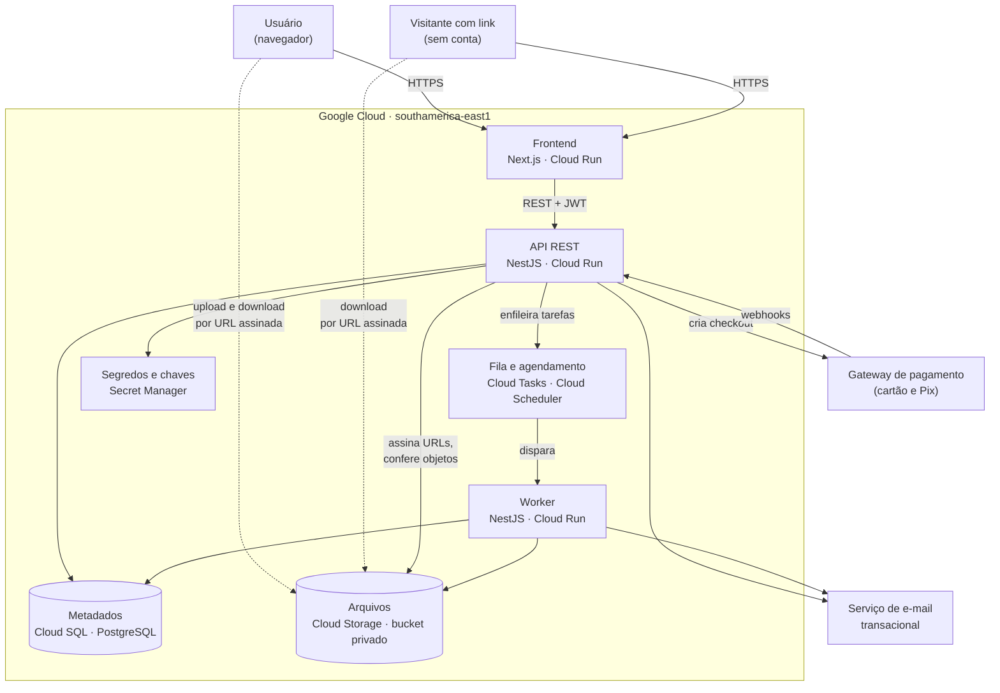
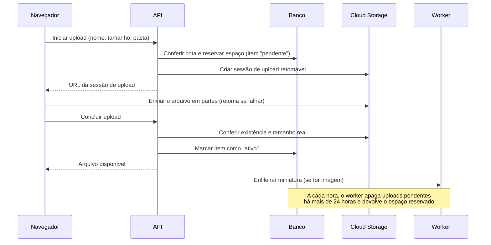

# HLD — Gerenciador de Arquivos (estilo Google Drive)

2026-10-08 · Luiz Carlos · Documento de origem: [product-brief.md](./product-brief.md)

## 1. Contexto e objetivos

Este documento descreve a arquitetura do MVP web do gerenciador de arquivos definido no product brief: um produto freemium para o público brasileiro, com 15 GB gratuitos, três planos pagos e três promessas (privacidade, simplicidade e preço).

**Objetivos de arquitetura**

- Manter o tráfego de arquivos fora dos servidores da aplicação, para que o custo cresça com o armazenamento e não com o processamento.
- Garantir a cota no servidor, inclusive com uploads simultâneos.
- Manter todos os dados no Brasil e todos os arquivos privados por padrão.
- Ser operável por uma equipe pequena, com serviços gerenciados.
- Expor uma API que os apps nativos da fase 2 possam reutilizar.

**Não objetivos**

- Múltiplas regiões e recuperação de desastre entre regiões.
- Microsserviços.
- Criptografia ponta a ponta (prevista para a fase 3).
- Conversão ou análise do conteúdo dos arquivos no servidor.
- Login social e autenticação em dois fatores.
- Moderação de conteúdo e tratamento de abuso, que o brief deixou fora de escopo.

## 2. Requisitos que moldam a arquitetura

**Funcionais**

As nove funcionalidades do MVP estão no brief. As que mais pesam no desenho são o upload de arquivos grandes com retomada, a lixeira com restauração, o compartilhamento por link com expiração e senha, a cota por plano e a contratação de planos com cartão e Pix.

**Não funcionais**

Os valores de usuários e volume são hipóteses de dimensionamento, porque a meta de contas ainda não foi definida no brief.

| Requisito | Valor de projeto |
| --- | --- |
| Contas no primeiro ano | Até 100 mil, com cerca de 10 mil ativas por mês |
| Volume armazenado | Até cerca de 100 TB |
| Tamanho máximo por arquivo | 5 GB, com upload retomável |
| Disponibilidade | 99,5% ao mês (cerca de 3,6 horas fora do ar) |
| Durabilidade dos arquivos | A do Cloud Storage, sem replicação própria |
| Latência da API de metadados | Abaixo de 300 ms no percentil 95 |
| Localização dos dados | Google Cloud, região `southamerica-east1` (São Paulo) |
| Privacidade | TLS em trânsito, criptografia em repouso, bucket privado e auditoria de acesso interno |

Nessa ordem de grandeza, um único banco PostgreSQL e um monólito dão conta. Se a expectativa passar para milhões de contas no primeiro ano, o desenho precisa ser revisto.

## 3. Arquitetura

O sistema é um monólito modular: um frontend Next.js, uma API NestJS e um worker que roda o mesmo código da API. Tudo fica no Google Cloud, numa única região.

As linhas tracejadas são o tráfego de arquivos, que vai direto do navegador ao Cloud Storage e nunca passa pela aplicação.

| Parte | Tecnologia | Responsabilidade |
| --- | --- | --- |
| Frontend | Next.js (React, TypeScript) em Cloud Run | Interface web, página pública dos links e guarda dos tokens em cookies |
| API | NestJS (TypeScript) em Cloud Run, com pelo menos duas instâncias | Regras de negócio, permissões, cota, assinatura de URLs e webhooks |
| Worker | Mesma imagem da API, em Cloud Run | Miniaturas, expurgo da lixeira, limpeza de uploads pendentes e cobranças Pix |
| Metadados | Cloud SQL para PostgreSQL | Usuários, itens, links, planos, assinaturas e tokens de renovação |
| Arquivos | Cloud Storage, bucket privado | Conteúdo dos arquivos e miniaturas |
| Fila e agendamento | Cloud Tasks e Cloud Scheduler | Tarefas assíncronas e rotinas periódicas |
| Segredos | Secret Manager | Chave de assinatura do JWT e credenciais de terceiros |

**Módulos da API:** contas e autenticação, arquivos e pastas, compartilhamento, cota, e cobrança. Cada módulo tem suas próprias tabelas e só fala com os outros por interfaces internas, o que permite extrair um serviço no futuro.

**Implantação:** as três partes são contêineres publicados no Cloud Run. O banco tem backup automático diário e recuperação a um ponto no tempo.

## 4. Fluxos principais

### 4.1 Autenticação

O login é só com e-mail e senha. A sessão no Next.js é stateless, e a comunicação entre o Next.js e a API usa JWT.

1. O usuário envia e-mail e senha. A API confere o hash da senha (Argon2id) e emite dois tokens.
2. O **token de acesso** é um JWT de 15 minutos, assinado com chave assimétrica. A API o valida só pela assinatura, sem consultar o banco.
3. O **token de renovação** vale 30 dias, é trocado a cada uso e tem o hash guardado no banco.
4. O Next.js guarda os dois em cookies `HttpOnly`, `Secure` e `SameSite`. O JavaScript da página não enxerga os tokens.
5. Sair, trocar a senha ou encerrar todos os dispositivos apaga os tokens de renovação. O acesso cai em até 15 minutos.

O cadastro exige verificação de e-mail, e a redefinição de senha usa um link de validade curta. O login tem limite de tentativas por conta e por IP.

### 4.2 Upload com reserva de cota

- **Reserva antes do envio:** o tamanho declarado é somado ao uso do usuário na mesma transação que cria o item. Uploads simultâneos não conseguem passar juntos do limite.
- **Conferência na conclusão:** se o tamanho real for diferente do declarado, o upload é rejeitado e o objeto é apagado.
- **Chave do objeto:** um identificador aleatório, independente do nome e da pasta. Renomear e mover alteram só o banco.

### 4.3 Download e pré-visualização

1. O navegador pede o arquivo à API, que confere a permissão.
2. A API devolve uma URL assinada de leitura, válida por poucos minutos.
3. O navegador baixa ou exibe o arquivo direto do Cloud Storage.

O próprio navegador exibe imagem, PDF, vídeo, áudio e texto. O servidor não converte arquivos, então documentos do Office têm apenas download. O worker gera miniaturas só para imagens.

### 4.4 Compartilhamento por link

1. O dono cria o link de um arquivo ou pasta, com expiração e senha opcionais. A API grava um token aleatório longo, o item, a expiração e o hash da senha.
2. O visitante abre a página pública no Next.js, que envia o token (e a senha, se houver) à API.
3. A API valida o token, a expiração e a senha, e devolve uma URL assinada de leitura de curta duração.
4. O link de uma pasta dá leitura a tudo o que está abaixo dela.

Apagar o link corta o acesso na hora, porque as URLs assinadas expiram em minutos.

### 4.5 Lixeira

- Excluir marca o item com uma data de exclusão. Excluir uma pasta marca só a pasta, e os filhos somem junto.
- Restaurar desfaz a marca.
- Itens na lixeira continuam contando para a cota.
- Depois de 30 dias, o worker apaga o item, remove o objeto do Cloud Storage e devolve o espaço à cota.

### 4.6 Assinatura e pagamento

1. O usuário escolhe o plano, e a API cria um checkout hospedado no gateway. Dados de cartão nunca passam pelo sistema.
2. O gateway envia webhooks a cada evento. A API valida a assinatura e grava o evento com o identificador dele, ignorando duplicados.
3. A cota só muda quando o webhook de pagamento aprovado chega, nunca pelo retorno do navegador.
4. **Cartão:** o gateway faz a cobrança recorrente.
5. **Pix:** o worker gera uma nova cobrança perto do vencimento e avisa o usuário por e-mail.
6. **Falha ou cancelamento:** depois de 7 dias de tolerância, a conta volta ao plano gratuito.
7. **Acima da cota após o rebaixamento:** nenhum arquivo é apagado. A conta fica em modo somente leitura (baixar e excluir funcionam, enviar não) até liberar espaço ou voltar a pagar.

## 5. Dados e integrações

**Entidades principais**

| Entidade | O que guarda | Onde vive |
| --- | --- | --- |
| Usuário | E-mail, hash da senha, plano atual e bytes usados | Cloud SQL |
| Token de renovação | Hash do token, usuário e validade | Cloud SQL |
| Item | Arquivo ou pasta: tipo, nome, item pai, dono, tamanho, status, chave do objeto e data de exclusão | Cloud SQL |
| Link de compartilhamento | Token, item, expiração e hash da senha | Cloud SQL |
| Plano | Nome, espaço e preço | Cloud SQL |
| Assinatura | Usuário, plano, período, situação e referência no gateway | Cloud SQL |
| Evento de pagamento | Identificador do gateway, tipo e conteúdo recebido | Cloud SQL |
| Conteúdo do arquivo e miniatura | Bytes | Cloud Storage |

**Decisões do modelo**

- **Hierarquia por lista de adjacência:** arquivos e pastas são a mesma entidade, e cada item aponta para o pai. Mover altera um único registro.
- **Cota por contador:** os bytes usados ficam no usuário e são atualizados na mesma transação que cria ou expurga um arquivo.
- **Busca por nome:** índice de texto do próprio PostgreSQL, sem serviço de busca separado.

**Integrações externas**

| Integração | Uso | Situação |
| --- | --- | --- |
| Cloud Storage | Upload retomável e URLs assinadas | Definido |
| Gateway de pagamento | Checkout hospedado, cartão recorrente, Pix e webhooks | Fornecedor a definir |
| Serviço de e-mail transacional | Verificação de e-mail, redefinição de senha e avisos de cobrança | Fornecedor a definir |

## 6. Decisões, riscos e questões em aberto

**Decisões e alternativas descartadas**

| Decisão | Alternativa descartada | Motivo |
| --- | --- | --- |
| Monólito modular | Microsserviços | Para 100 mil contas, microsserviços só somam custo operacional. |
| Backend separado do frontend | Full-stack único em Next.js | Os apps nativos da fase 2 vão consumir a mesma API. |
| Upload direto ao storage, com reserva de cota | Upload passando pela API | A API teria de carregar arquivos de até 5 GB, o que encarece e limita a escala. |
| Lista de adjacência | Caminho materializado | Mover uma pasta obrigaria a reescrever todos os descendentes. |
| Lixeira conta para a cota | Lixeira fora da cota | Deixaria 30 dias de armazenamento sem cobertura de receita. |
| Bucket privado com URLs assinadas curtas | Objetos públicos para links | Sustenta a promessa de privacidade e permite revogar e auditar. |
| Sem conversão de arquivos no servidor | Pré-visualização de Office | Exigiria processar o conteúdo, com custo alto e atrito com a promessa de privacidade. |
| Só e-mail e senha | Login com Google | Decisão de produto; o brief foi ajustado. |
| JWT de 15 minutos + renovação com hash no banco | JWT longo, totalmente stateless | Permite cortar o acesso ao sair ou trocar a senha. |
| Checkout hospedado e webhook como fonte da verdade | Formulário de cartão próprio | Evita as exigências de PCI e a liberação de cota por retorno forjado. |
| Google Cloud, uma região em São Paulo | Fornecedores combinados ou servidores próprios | Dados no Brasil sob um único contrato e operação gerenciada. |

**Riscos**

| Risco | Mitigação |
| --- | --- |
| Custo de tráfego de saída (download) maior que o de armazenamento | Medir o custo por GB baixado antes do lançamento e avaliar limites de tráfego por link. |
| Armazenamento sem receita de contas rebaixadas acima da cota | Definir um prazo máximo de retenção, com avisos. |
| Espaço preso por uploads abandonados | Limpeza de pendentes a cada hora, com limite de 24 horas. |
| Segurança da autenticação sob responsabilidade própria | Usar bibliotecas consolidadas do NestJS e limitar tentativas de login. |
| Miniaturas leem o conteúdo de imagens | Descrever esse processamento na política de privacidade. |
| Dimensionamento baseado em hipóteses de usuários | Rever os valores quando a meta de contas for definida. |

**Questões em aberto**

- [ ] Escolha do gateway de pagamento e do serviço de e-mail transacional.
- [ ] Custo real por GB armazenado e por GB baixado no Google Cloud, cruzado com os preços dos planos.
- [ ] Prazo máximo de retenção dos arquivos de contas rebaixadas acima da cota.
- [ ] Confirmação do limite de 5 GB por arquivo e dos 30 dias de lixeira, que o brief deixou em aberto.
- [ ] Alta disponibilidade do Cloud SQL (réplica em outra zona): custo contra a meta de 99,5%.
- [ ] Observabilidade: logs, métricas e alertas ainda não foram desenhados.
- [ ] Prazo, equipe e orçamento, que continuam indefinidos no brief.
